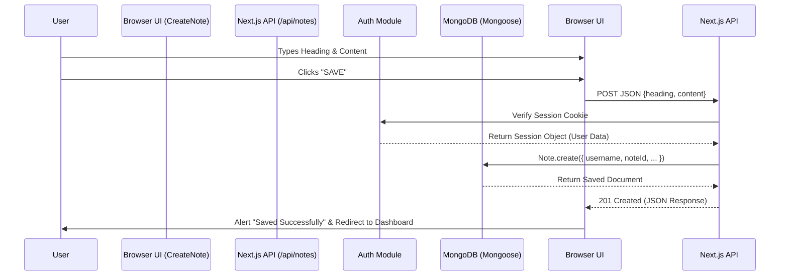

# 📓 CoolNotes - Premium Full-Stack Note Taking Application

CoolNotes is a high-performance, aesthetically premium full-stack note-taking application. It is engineered using the latest React and Next.js paradigms, focusing on a seamless user experience, secure authentication, and a robust database architecture.

---

## 🚀 Comprehensive Tech Stack

### Frontend Architecture
- **Framework**: **Next.js 16.2.6 (App Router)** - Utilizing Server Components for layout and data fetching, and Client Components for interactive UI elements.
- **Library**: **React 19.2** - Using modern hooks (`useState`, `useEffect`) and strict mode.
- **Styling**: **Tailwind CSS 4** - Implementing a custom design system based on CSS variables (HSL) for themes. Features a heavy emphasis on "Glassmorphism" (semi-transparent blurred backgrounds), micro-animations (hover scaling, transitions), and deep dark/light mode compatibility.
- **Icons**: **Lucide React** - For consistent, scalable vector iconography across the application (sidebar, buttons).

### Backend & API Architecture
- **Routing Engine**: Next.js App Router (`app/api/*`) handles all RESTful backend endpoints natively.
- **Middleware**: Edge-runtime middleware (`middleware.ts`) intercepts requests to enforce authorization at the network edge before pages render.

### Database & Authentication
- **Primary Database**: **MongoDB** (Atlas Cloud).
- **ORM / ODM Strategy**: A sophisticated **Hybrid Approach**:
  - **MongoClient (Native)**: Used strictly by the Authentication adapter for maximum performance and low-level control over user/session collections.
  - **Mongoose**: Used for application business logic (Notes, Categories) to leverage strict schema validation, type casting, and middleware.
  - **Connection Pooling**: Implemented a global connection caching utility (`lib/db.ts`) to prevent connection flooding during Next.js Hot Module Replacement (HMR).
- **Auth Provider**: **Better Auth (^1.6.11)** - Handling complex authentication flows (Email/Password & Google OAuth) with session management and cryptographic security. Assisted by `@better-fetch/fetch` for edge-compatible session verification.

---

## 🏗️ Detailed Application Flow & Network Architecture

The application operates on a strict separation of concerns. Here is the minute-by-minute lifecycle of data within the app.

### 1. The Authentication Lifecycle (AuthN & AuthZ)

**Sign Up / Login Flow:**
1. **User Action**: User enters credentials in `app/signup/page.tsx` or clicks "Continue with Google".
2. **Client Request**: `authClient.signUp.email()` or `signIn.social()` is triggered.
3. **Backend Processing**: The request hits the Better Auth catch-all route `app/api/auth/[...all]/route.ts`.
4. **Database Write**: The MongoDB Adapter creates a new document in the `user` collection and generates a secure session token in the `session` collection.
5. **Cookie Placement**: The server responds with an HTTP-only secure cookie containing the session ID.
6. **Redirection**: On success, `next/navigation`'s `useRouter` pushes the client to the `/` dashboard.

**Route Protection (Authorization Guard):**
1. **Intercept**: Every time a user requests a page (e.g., `/`), `middleware.ts` intercepts the request.
2. **Session Verification**: The middleware uses `betterFetch("/api/auth/get-session")` to validate the cookie against the database.
3. **Decision Matrix**:
   - If *No Session* AND trying to access protected route -> Redirect to `/login`.
   - If *Valid Session* -> Proceed to `NextResponse.next()` (render the page).

### 2. The Note Creation Flow (Frontend to Database)



### 3. The Data Retrieval Flow (Database to Dashboard)
*(Currently in Development)*
1. **Dashboard Load**: The user navigates to `/`.
2. **Fetch Trigger**: A React `useEffect` or Server Component calls `GET /api/notes`.
3. **Session Verification**: The API validates the user to ensure data privacy.
4. **Query Execution**: Mongoose executes `Note.find({ username: current_user }).sort({ createdAt: -1 })`.
5. **Render Cycle**: The returned JSON array is mapped into dynamic `Card` components, calculating heights and displaying statistics.

---

## 🗄️ Database Schema Breakdown

### The `Note` Schema (`lib/models/Note.ts`)
The core data structure relies on strict typing to prevent dirty data:
- `username` *(String, Required)*: The Better Auth username. Acts as the foreign key linking notes to the creator.
- `noteId` *(String, Required, Unique)*: A composite key generated via `Date.now() + formatted_heading` to ensure collision-free URLs or referencing.
- `heading` *(String, Required)*: The title of the note.
- `content` *(String, Optional)*: The body text of the note.
- `private` *(Boolean, Required)*: Defaults to true. Determines visibility in the "Public Space" feature.

---

## 📁 Directory Structure & Key Files

```text
coolnotes/
├── app/
│   ├── api/
│   │   ├── auth/[...all]/route.ts  # Better Auth Core API endpoints
│   │   └── notes/route.ts           # Custom REST API for CRUD operations on Notes
│   ├── login/page.tsx               # Client component for user authentication
│   ├── signup/page.tsx              # Client component for user registration
│   ├── notes/
│   │   └── create/page.tsx          # Note editor UI interface
│   ├── globals.css                  # Core CSS variables, Tailwind tokens, and .glass classes
│   ├── layout.tsx                   # Server-side Root Layout (Injects fonts & Sidebar)
│   └── page.tsx                     # Main Dashboard / UI Analytics View
├── components/
│   ├── Sidebar.tsx                  # Client component for navigation and Logout logic
│   └── barCard.tsx                  # Dynamic data visualization component
├── lib/
│   ├── auth.ts                      # Better Auth Server Configuration & Providers
│   ├── auth-client.ts               # Better Auth Client Hook initializer
│   ├── db.ts                        # Global MongoDB/Mongoose connection manager
│   └── models/
│       └── Note.ts                  # Mongoose Schema definition for notes
├── middleware.ts                    # Edge-runtime authentication routing guard
└── tailwind.config.ts               # Custom UI tokens, colors, and border radiuses
```

---

## 🎨 UI/UX Design Philosophy

The application strictly adheres to a **Modern Premium** aesthetic:
1. **Typography**: Uses Next.js optimized Google Fonts (`Geist` and `Geist_Mono`) for sharp, legible text.
2. **Color Palette**: Relies on specific HSL values for `background`, `foreground`, `border`, and `primary` to allow seamless dark-mode transitions.
3. **Glassmorphism**: The `.glass` utility class combines semi-transparent backgrounds (`bg-white/50`), strong backdrop blurs, and subtle white borders to create a frosted glass effect layered over gradients.
4. **Interactive Feedback**: Every button and link includes `transition-all`, `hover:scale-105`, and group-hover transforms on icons to make the application feel responsive and "alive."
