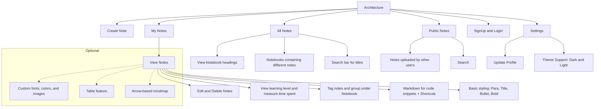

# DevNotes Architecture 📝

Below is the visualized architecture flow for the project:



---

### Original Flow Reference:
```text
Architecture: 
create note
my notes
my notes --> view notes --> edit and delete notes
                        --> view learning level and measures the time spent on the specific note
                        --> tag notes and group them under a notebook
                        --> markdown option for code snippet with shortcut
                        --> Basic styling like para, title, bullet and bold

                        //Optional
                        --> option to choose fonts and diffrent text colors and add images to the notes
                        --> feature to add a table
                        --> arrow based mindmap

         --> all notes  --> view heading of notebook
                        --> notebooks contain diffrent notes
                        --> searchbar for notes(title)
                        
         --> Public notes   --> notes uploaded by other users
                            --> Search 

        --> signUp and logIn

        --> setting     --> update profile
                        --> theme(dark and light)
```
